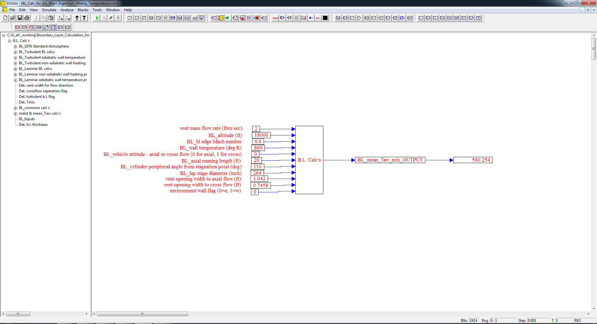
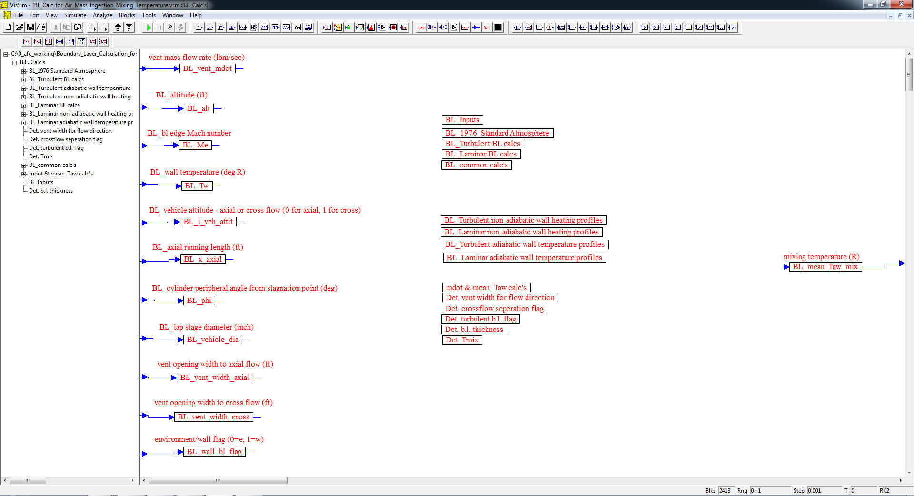

# ========================================
# Boundary Layer Calculation for Air Mass Ingestion Mixing Temperature using VISSIM:
# ========================================

## I. Rocket/Air-Vehicle Boundary Layer Sub-System Top Level Diagram:

## II. Boundary Layer Calculations Sub-System Level Diagram:

## 
## *Note: Performance Data and Analysis performed using VISSIM, ( https://web.solidthinking.com/vissim-is-now-solidthinking-embed )
